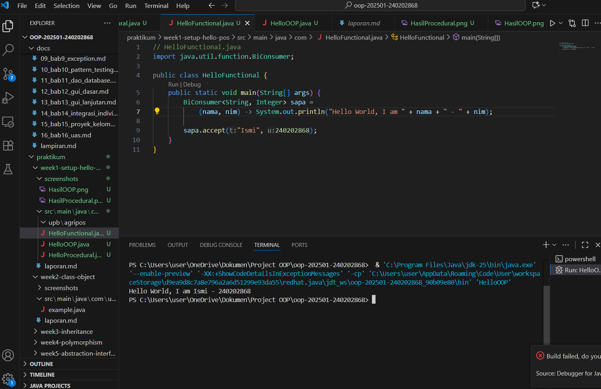
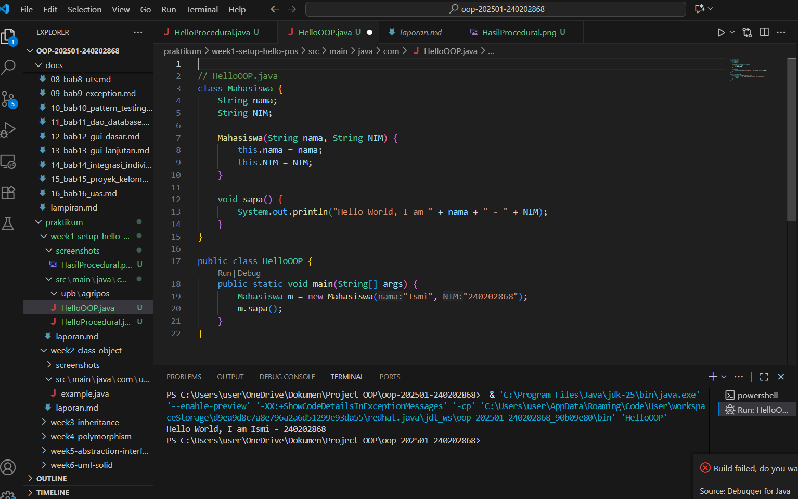
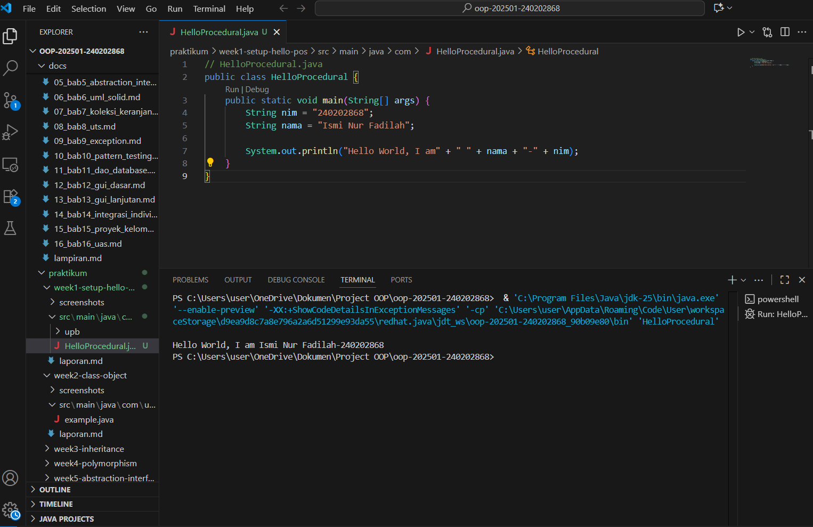

# Laporan Praktikum Minggu 1 (sesuaikan minggu ke berapa?)
Topik: [Pengenalan Paradigma dan Setup Proyek]

## Identitas
- Nama  : [Ismi Nur Fadilah]
- NIM   : [240202868]
- Kelas : [3IKRB]

---

## Tujuan
Mahasiswa mampu mendefinisikan paradigma prosedural, OOP, dan fungsional.
Mahasiswa mampu membandingkan kelebihan dan keterbatasan tiap paradigma.
Mahasiswa mampu memberikan contoh program sederhana untuk masing-masing paradigma.
Mahasiswa aktif dalam diskusi kelas (bertanya, menjawab, memberi opini).

---

## Dasar Teori
Paradigma pemrograman adalah cara pandang dalam menyusun program:

- Prosedural: program dibangun sebagai rangkaian perintah (fungsi/prosedur).
- OOP (Object-Oriented Programming): program dibangun dari objek yang memiliki data (atribut) dan perilaku (method).
- Fungsional: program dipandang sebagai pemetaan fungsi matematika, lebih menekankan ekspresi dan transformasi data.
- Dalam konteks Agri-POS, OOP membantu memodelkan entitas nyata seperti Produk, Transaksi, dan Pembayaran sebagai objek. Dengan demikian, sistem lebih mudah dikembangkan dan dipelihara.

---

## Langkah Praktikum

1. Setup Project

   - Pastikan sudah menginstall JDK (Java Development Kit), IDE (misal: IntelliJ IDEA, VS Code, NetBeans), Git, PostgreSQL, dan JavaFX di komputer.
   - Buat folder project oop-pos-<nim>.
   - Inisialisasi repositori Git.
   - Buat struktur awal src/main/java/com/upb/agripos/.
   - Pastikan semua tools dapat berjalan (uji dengan membuat dan menjalankan program Java sederhana).

2. Program Sederhana dalam 3 Paradigma

   - Prosedural: program untuk menghitung total harga dua produk.
   - OOP: class Produk dengan atribut nama dan harga, buat minimal tiga objek, lalu hitung total.
   - Fungsional: gunakan Stream atau lambda untuk menghitung total harga dari minimal tiga objek.

3. Commit dan Push

   Commit dengan pesan: week1-setup-hello-pos.

---

## Kode Program
1. Procedural

```java
// HelloProcedural.java
public class HelloProcedural {
    public static void main(String[] args) {
        String nim = "240202868";
        String nama = "Ismi Nur Fadilah";

        System.out.println("Hello World, I am" + " " + nama + "-" + nim);
    }
}
```


2. OOP

```java
// HelloOOP.java
class Mahasiswa {
    String nama;
    String NIM;

    Mahasiswa(String nama, String NIM) {
        this.nama = nama;
        this.NIM = NIM;
    }

    void sapa() {
        System.out.println("Hello World, I am " + nama + " - " + NIM);
    }
}

public class HelloOOP {
    public static void main(String[] args) {
        Mahasiswa m = new Mahasiswa("Ismi", "240202868");
        m.sapa();
    }
}
```


3. Functional

```java
   // HelloFunctional.java
import java.util.function.BiConsumer;

public class HelloFunctional {
    public static void main(String[] args) {
        BiConsumer<String, Integer> sapa =
            (nama, nim) -> System.out.println("Hello World, I am " + nama + " - " + nim);
        
        sapa.accept("Ismi", 240202868);
    }
}
```

---

## Hasil Eksekusi





---

## Analisis
(
1. Penjelasan cara kerja kode

    - Program Procedural: Semua logika program ditulis langsung di dalam main(). Program berjalan secara berurutan — mendeklarasikan variabel, lalu mencetak teks menggunakan System.out.println().

    - Program OOP (Object-Oriented Programming): Program dibagi menjadi kelas dan objek. Kelas Mahasiswa menyimpan atribut (nama, NIM) dan perilaku (sapa()). Di dalam main(), objek Mahasiswa dibuat, lalu metode sapa() dipanggil untuk menampilkan pesan.

    - Program Functional: Menggunakan konsep fungsi sebagai objek. Fungsi BiConsumer digunakan untuk menerima dua parameter (nama dan nim) dan langsung mengeksekusi ekspresi lambda yang mencetak teks ke layar.

2. Perbedaan pendekatan dibanding minggu sebelumnya

    - Paradigma Prosedural fokus pada langkah-langkah (algoritma) dan urutan instruksi.

    - Paradigma OOP fokus pada objek yang memiliki data dan perilaku. Pendekatan ini membuat kode lebih mudah dikelola dan dikembangkan.

    - Paradigma Fungsional fokus pada fungsi murni dan ekspresi, bukan pada perubahan data. Pendekatan ini lebih ringkas dan minim efek samping.

3. Kendala dan cara mengatasinya

    - Awalnya sedikit bingung dengan struktur class dan constructor pada OOP, tetapi setelah memahami konsep instansiasi objek, kode bisa dijalankan dengan benar.

    - Pada bagian Functional, perlu menambahkan import java.util.function.BiConsumer agar kode dapat dikompilasi. Setelah itu, program berjalan lancar.
)
---

## Kesimpulan
   Melalui praktikum ini, saya memahami perbedaan antara paradigma prosedural, OOP, dan fungsional dalam pemrograman.
   Paradigma prosedural cocok untuk program sederhana, sedangkan OOP lebih terstruktur dan mudah dikembangkan karena memanfaatkan konsep class dan object. Paradigma fungsional membantu menulis kode yang lebih ringkas dan bebas efek samping.
   Dengan memahami ketiga paradigma ini, saya dapat memilih pendekatan yang paling sesuai untuk membangun aplikasi — terutama OOP yang sangat cocok untuk pengembangan sistem POS (Point of Sale) yang kompleks dan berorientasi pada objek nyata.
---

## Quiz
1. Apakah OOP selalu lebih baik dari prosedural?  
   **Jawaban:** Tidak selalu. OOP lebih baik ketika program kompleks dan membutuhkan banyak objek yang saling berinteraksi. Namun, untuk program kecil dan sederhana, paradigma prosedural bisa lebih efisien dan mudah dipahami. 

2. Kapan functional programming lebih cocok digunakan dibanding OOP atau prosedural?  
   **Jawaban:** Functional programming lebih cocok digunakan ketika program berfokus pada pengolahan data dalam jumlah besar, pemrosesan paralel, atau operasi yang membutuhkan ketepatan matematis, seperti analisis data, pemrosesan sinyal, atau komputasi ilmiah. 

3. Bagaimana paradigma (prosedural, OOP, fungsional) memengaruhi maintainability dan scalability aplikasi?  
   **Jawaban:** 
      - Prosedural: mudah dibuat namun sulit diperluas karena logika bercampur dalam satu alur.

      - OOP: meningkatkan maintainability dan scalability karena kode terorganisir dalam class dan object yang mudah diperbarui atau dikembangkan.

      - Fungsional: lebih mudah diuji dan dirawat karena tidak memiliki efek samping (pure function), sehingga cocok untuk aplikasi besar yang membutuhkan stabilitas tinggi. 

4. Mengapa OOP lebih cocok untuk mengembangkan aplikasi POS dibanding prosedural?
   **Jawaban:** Karena sistem POS terdiri dari banyak entitas nyata seperti Produk, Pelanggan, dan Transaksi yang bisa dimodelkan sebagai objek. Dengan OOP, setiap entitas memiliki atribut dan perilakunya sendiri, sehingga sistem lebih mudah dikembangkan, diperluas, dan dikelola.

5. Bagaimana paradigma fungsional dapat membantu mengurangi kode berulang (boilerplate code)?
   **Jawaban:** Karena functional programming menggunakan konsep seperti lambda expression, map, filter, dan reduce yang memungkinkan operasi data dilakukan secara ringkas tanpa menulis banyak perulangan atau kondisi berulang, sehingga kode menjadi lebih singkat dan mudah dibaca.

