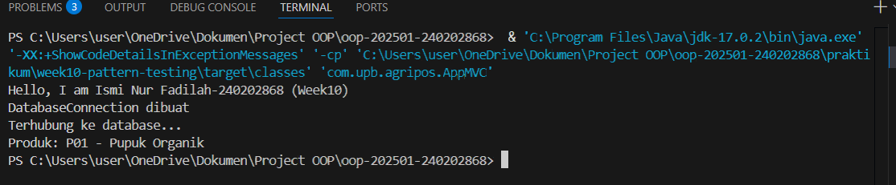
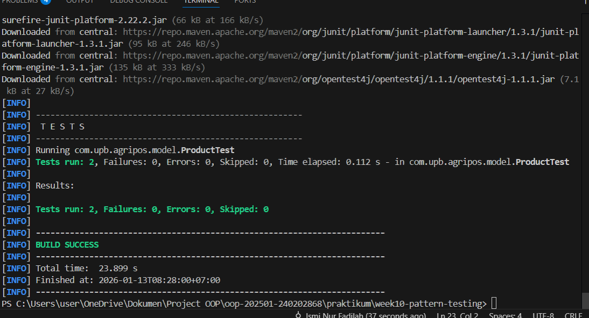

# Laporan Praktikum Minggu 10

Topik: **Design Pattern (Singleton, MVC) dan Unit Testing menggunakan JUnit**

## Identitas

* Nama  : Ismi Nur Fadilah
* NIM   : 240202868
* Kelas : 3IKRB

---

## Tujuan

Tujuan dari praktikum minggu ke-10 ini adalah agar mahasiswa mampu memahami dan menerapkan konsep **design pattern** dalam pengembangan perangkat lunak, khususnya **Singleton Pattern** dan **Model–View–Controller (MVC)**, serta mampu membuat dan menjalankan **unit testing menggunakan JUnit** untuk memastikan kualitas dan kebenaran fungsi program.

---

## Dasar Teori

1. **Design Pattern** merupakan solusi umum yang telah teruji untuk menyelesaikan permasalahan desain perangkat lunak.
2. **Singleton Pattern** memastikan suatu class hanya memiliki satu instance selama aplikasi berjalan.
3. **MVC (Model–View–Controller)** memisahkan aplikasi menjadi tiga bagian agar kode lebih terstruktur dan mudah dipelihara.
4. **Model** berisi data dan logika bisnis, **View** menangani tampilan, dan **Controller** menjadi penghubung antara Model dan View.
5. **Unit Testing** menggunakan JUnit digunakan untuk menguji bagian kecil dari program secara terpisah.

---

## Langkah Praktikum

1. Membuat project Java berbasis Maven dengan struktur direktori yang sesuai.
2. Mengimplementasikan **Singleton Pattern** pada class `DatabaseConnection`.
3. Membuat struktur **MVC sederhana** yang terdiri dari:

   * Model: `Product`
   * View: `ConsoleView`
   * Controller: `ProductController`
4. Membuat program utama `AppMVC` untuk mengintegrasikan seluruh komponen MVC.
5. Membuat **unit test** menggunakan JUnit pada class `Product`.
6. Menjalankan unit test menggunakan perintah `mvn test`.
7. Mendokumentasikan hasil pengujian dan melakukan commit dengan pesan:

   ```
   week10-pattern-testing: implement singleton, mvc, and junit testing
   ```

---

## Kode Program

Contoh kode utama pada Program:
1. Database Connection

```java
package com.upb.agripos.config;

public class DatabaseConnection {

    private static DatabaseConnection instance;

    // constructor private → wajib untuk Singleton
    private DatabaseConnection() {
        System.out.println("DatabaseConnection dibuat");
    }

    // global access point
    public static DatabaseConnection getInstance() {
        if (instance == null) {
            instance = new DatabaseConnection();
        }
        return instance;
    }

    public void connect() {
        System.out.println("Terhubung ke database...");
    }
}
```

2. Product Controller

```java
package com.upb.agripos.controller;

import com.upb.agripos.model.Product;
import com.upb.agripos.view.ConsoleView;

public class ProductController {
    private final Product model;
    private final ConsoleView view;

    public ProductController(Product model, ConsoleView view) {
        this.model = model;
        this.view = view;
    }

    public void showProduct() {
        view.showMessage("Produk: " + model.getCode() + " - " + model.getName());
    }
}
```

3. Main Program – AppMVC

```java
package com.upb.agripos;

import com.upb.agripos.config.DatabaseConnection;
import com.upb.agripos.controller.ProductController;
import com.upb.agripos.model.Product;
import com.upb.agripos.view.ConsoleView;

public class AppMVC {
    public static void main(String[] args) {

        System.out.println("Hello, I am Ismi Nur Fadilah-240202868 (Week10)");

        // Singleton test
        DatabaseConnection db1 = DatabaseConnection.getInstance();
        db1.connect();

        // MVC
        Product product = new Product("P01", "Pupuk Organik");
        ConsoleView view = new ConsoleView();
        ProductController controller = new ProductController(product, view);

        controller.showProduct();
    }
}
```

4. Unit Testing – ProductTest (JUnit)

```java
package com.upb.agripos.model;

import static org.junit.jupiter.api.Assertions.assertEquals;
import org.junit.jupiter.api.Test;

public class ProductTest {

    @Test
    public void testProductName() {
        Product product = new Product("P01", "Benih Jagung");
        assertEquals("Benih Jagung", product.getName());
    }

    @Test
    public void testProductCode() {
        Product product = new Product("P02", "Pupuk Cair");
        assertEquals("P02", product.getCode());
    }
}
```

---

## Hasil Eksekusi

Berikut adalah hasil eksekusi program dan unit testing menggunakan JUnit:





Hasil menunjukkan bahwa program berjalan dengan baik dan unit test berhasil dijalankan tanpa error.

---

## Analisis

* Program berjalan dengan menerapkan pemisahan tanggung jawab antara Model, View, dan Controller.
* Dibandingkan minggu sebelumnya, pendekatan minggu ini lebih terstruktur karena menggunakan design pattern.
* Kendala yang dihadapi adalah konfigurasi Maven dan JUnit, namun dapat diatasi dengan memastikan dependensi pada `pom.xml` sudah benar.

---

## Kesimpulan

Berdasarkan praktikum yang telah dilakukan, dapat disimpulkan bahwa penerapan **Singleton Pattern**, **MVC**, dan **Unit Testing** mampu meningkatkan struktur, keterbacaan, dan kualitas perangkat lunak. Pengujian dengan JUnit membantu memastikan fungsi program berjalan sesuai dengan yang diharapkan.

---

## Quiz

1. **Mengapa constructor pada Singleton harus bersifat private?**
   **Jawaban:** Agar objek tidak dapat dibuat secara langsung dari luar class sehingga hanya satu instance yang digunakan.

2. **Jelaskan manfaat pemisahan Model, View, dan Controller.**
   **Jawaban:** Memudahkan pengelolaan kode, meningkatkan keterbacaan, serta mempermudah pengembangan dan pemeliharaan aplikasi.

3. **Apa peran unit testing dalam menjaga kualitas perangkat lunak?**
   **Jawaban:** Untuk memastikan setiap fungsi berjalan sesuai harapan dan mendeteksi kesalahan sejak dini.

4. **Apa risiko jika Singleton tidak diimplementasikan dengan benar?**
   **Jawaban:** Dapat menyebabkan lebih dari satu instance terbentuk sehingga mengakibatkan pemborosan resource dan inkonsistensi data.
