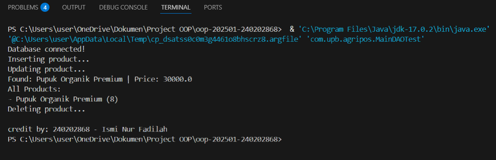

# Laporan Praktikum Minggu 11
Topik: Data Access Object (DAO) dan CRUD Database dengan JDBC

## Identitas
- Nama  : Ismi Nur Fadilah
- NIM   : 240202868
- Kelas : 3IKRB

---

## Tujuan
Mahasiswa mampu memahami konsep Data Access Object (DAO) serta menghubungkan aplikasi Java dengan database PostgreSQL menggunakan JDBC. Selain itu, mahasiswa dapat mengimplementasikan operasi CRUD (Create, Read, Update, Delete) secara terstruktur sesuai prinsip Object Oriented Programming (OOP).

---

## Dasar Teori
1. Data Access Object (DAO) adalah pola desain yang memisahkan logika akses data dari logika bisnis aplikasi.
2. JDBC (Java Database Connectivity) digunakan untuk menghubungkan aplikasi Java dengan database relasional.
3. PreparedStatement digunakan untuk mengeksekusi perintah SQL secara aman dan efisien.
4. CRUD terdiri dari Create, Read, Update, dan Delete data.
5. Penerapan DAO membuat kode lebih terstruktur dan mudah dipelihara.

---

## Langkah Praktikum
1. Membuat database `agripos` dan tabel `products` pada PostgreSQL.
2. Membuat class model `Product`.
3. Membuat interface `ProductDAO`.
4. Mengimplementasikan class `ProductDAOImpl` menggunakan JDBC.
5. Mengintegrasikan DAO dengan class `MainDAOTest`.
6. Menjalankan program untuk menguji operasi CRUD.
7. Melakukan commit dengan pesan:
---

## Kode Program
Contoh kode utama dalam program yaitu MainDAOTest.java:

```java
package com.upb.agripos;

import java.sql.Connection;
import java.sql.DriverManager;
import java.util.List;

import com.upb.agripos.dao.ProductDAO;
import com.upb.agripos.dao.ProductDAOImpl;
import com.upb.agripos.model.Product;

public class MainDAOTest {
    public static void main(String[] args) throws Exception {
        Class.forName("org.postgresql.Driver");
        Connection conn = DriverManager.getConnection(
            "jdbc:postgresql://localhost:5432/agripos",
            "postgres",
            "1234"
        );

        System.out.println("Database connected!");
        ProductDAO dao = new ProductDAOImpl(conn);

        // Bersihkan data lama agar tidak error duplicate key saat insert ulang
        dao.delete("P01");

        // 1. Insert
        System.out.println("Inserting product...");
        dao.insert(new Product("P01", "Pupuk Organik", 25000, 10));
        
        // 2. Update
        System.out.println("Updating product...");
        dao.update(new Product("P01", "Pupuk Organik Premium", 30000, 8));

        // 3. Find By Code
        Product p = dao.findByCode("P01");
        System.out.println("Found: " + p.getName() + " | Price: " + p.getPrice());

        // 4. Find All
        System.out.println("All Products:");
        List<Product> list = dao.findAll();
        for (Product prod : list) {
            System.out.println("- " + prod.getName() + " (" + prod.getStock() + ")");
        }

        // 5. Delete
        System.out.println("Deleting product...");
        dao.delete("P01");
        
        conn.close();
        System.out.println("\ncredit by: 240202868 - Ismi Nur Fadilah");
    }
}
```

---

## Hasil Eksekusi
Hasil eksekusi program.  



---

## Analisis
(
Kode program dijalankan dengan memanfaatkan pola desain DAO sehingga query SQL tidak dituliskan langsung pada class utama. Pendekatan ini berbeda dari minggu sebelumnya karena sudah melibatkan koneksi database dan pemisahan tanggung jawab antar class. Kendala utama yang ditemui adalah konfigurasi koneksi database, yang dapat diatasi dengan memastikan driver JDBC dan pengaturan database sudah benar.
)
---

## Kesimpulan
Penerapan Data Access Object (DAO) dan JDBC memungkinkan aplikasi Java terhubung dengan database secara terstruktur. Operasi CRUD dapat dijalankan dengan baik dan kode program menjadi lebih rapi, modular, serta mudah dikembangkan.

---

## Quiz
(Apa fungsi utama Data Access Object (DAO)?
**Jawaban**: Memisahkan logika akses data dari logika bisnis aplikasi.

Mengapa PreparedStatement lebih aman digunakan dibanding Statement?
**Jawaban**: Karena mencegah SQL Injection dan meningkatkan efisiensi eksekusi query.

Sebutkan operasi yang termasuk dalam CRUD!
**Jawaban**: Create, Read, Update, dan Delete.)
