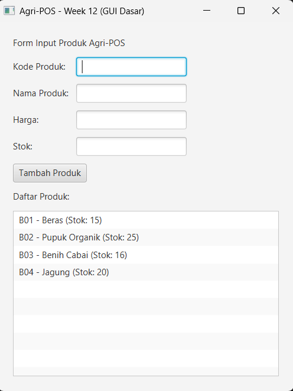

# Laporan Praktikum Minggu 12 
Topik: "GUI Dasar JavaFX (Event-Driven Programming)"

## Identitas
- Nama  : [Ismi Nur Fadilah]
- NIM   : [240202868]
- Kelas : [3IKRB]

---

## Tujuan
Tujuan dari praktikum ini adalah agar mahasiswa mampu memahami konsep event-driven programming serta membangun antarmuka grafis sederhana menggunakan JavaFX. Selain itu, mahasiswa diharapkan dapat mengintegrasikan GUI dengan backend aplikasi menggunakan konsep MVC, Service, dan DAO tanpa menuliskan ulang logika CRUD pada layer tampilan.

---

## Dasar Teori
1. JavaFX merupakan framework Java yang digunakan untuk membangun aplikasi berbasis antarmuka grafis (GUI).
2. Event-driven programming adalah paradigma pemrograman yang mengeksekusi logika program berdasarkan event dari pengguna, seperti klik tombol.
3. Pola desain MVC (Model-View-Controller) digunakan untuk memisahkan logika bisnis, tampilan, dan pengendali aplikasi.
4. Data Access Object (DAO) berfungsi untuk memisahkan akses database dari logika bisnis aplikasi.
5. Service layer berperan sebagai penghubung antara controller dan DAO sesuai prinsip SOLID (Dependency Inversion Principle).

---

## Langkah Praktikum
1. Menyiapkan project Maven dengan dependency JavaFX dan PostgreSQL.
2. Menyesuaikan versi Java compiler ke Java 17 agar kompatibel dengan runtime.
3. Membuat class `Product` sebagai model data produk.
4. Mengimplementasikan `ProductDAO` untuk operasi database.
5. Membuat `ProductService` sebagai layer bisnis.
6. Membuat GUI JavaFX berupa form input produk dan area tampilan data.
7. Menambahkan event handler pada tombol “Tambah Produk”.
8. Menghubungkan event GUI dengan `ProductController` dan `ProductService`.
9. Menjalankan aplikasi menggunakan perintah `mvn javafx:run`.
10. Melakukan commit 

---

## Kode Program
Contoh kode utama yang dibuat:
- Product Controller

```java
package com.upb.agripos.controller;

import java.util.List;
import com.upb.agripos.model.Product;
import com.upb.agripos.service.ProductService;
import com.upb.agripos.view.ProductFormView;
import javafx.scene.control.Alert;

public class ProductController {
    private final ProductService service;
    private final ProductFormView view;

    public ProductController(ProductService service, ProductFormView view) {
        this.service = service;
        this.view = view;
        initController();
    }

    private void initController() {
        // Event Handler untuk tombol Tambah
        view.getBtnAdd().setOnAction(e -> addProduct());
        
        // Load data awal
        loadData();
    }

    private void addProduct() {
        try {
            String code = view.getTxtCode().getText();
            String name = view.getTxtName().getText();
            double price = Double.parseDouble(view.getTxtPrice().getText());
            int stock = Integer.parseInt(view.getTxtStock().getText());

            Product p = new Product(code, name, price, stock);
            service.addProduct(p);
            
            view.clearForm();
            loadData(); // Refresh list
        } catch (NumberFormatException ex) {
            new Alert(Alert.AlertType.ERROR, "Harga dan Stok harus berupa angka!").show();
        } catch (Exception ex) {
            new Alert(Alert.AlertType.ERROR, "Gagal menyimpan: " + ex.getMessage()).show();
        }
    }

    private void loadData() {
        view.getListView().getItems().clear();
        List<Product> products = service.getAllProducts();
        for (Product p : products) {
            view.getListView().getItems().add(p.getCode() + " - " + p.getName() + " (Stok: " + p.getStock() + ")");
        }
    }
}
```

---

## Hasil Eksekusi 


---

## Analisis
Pada praktikum ini, aplikasi berjalan menggunakan konsep event-driven programming, di mana aksi pengguna pada tombol akan memicu proses penambahan data produk. Dibandingkan praktikum sebelumnya yang berbasis console, praktikum ini menampilkan output secara visual melalui GUI. Kendala yang dihadapi adalah ketidaksesuaian versi Java compiler dengan runtime, yang menyebabkan error UnsupportedClassVersionError. Masalah tersebut diatasi dengan menyamakan versi compiler ke Java 17 pada file pom.xml.
---

## Kesimpulan
Berdasarkan praktikum ini, dapat disimpulkan bahwa penggunaan JavaFX memungkinkan pembuatan antarmuka grafis yang interaktif dan mudah digunakan. Dengan menerapkan konsep MVC, Service, dan DAO, struktur aplikasi menjadi lebih terorganisir serta sesuai dengan prinsip desain perangkat lunak yang baik.
---


