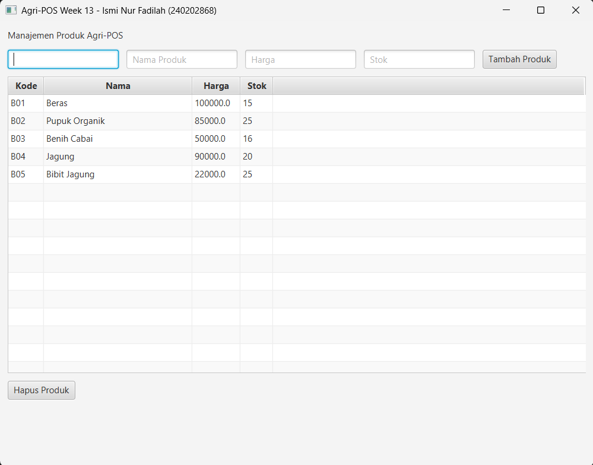

# Laporan Praktikum Minggu 13  
**Topik:** GUI Lanjutan JavaFX (TableView dan Lambda Expression)

## Identitas
- **Nama**  : Ismi Nur Fadilah  
- **NIM**   : 240202868  
- **Kelas** : 3IKRB  

---

## Tujuan
Praktikum ini bertujuan agar mahasiswa mampu menampilkan data dari database ke dalam TableView JavaFX, mengintegrasikan GUI dengan DAO melalui service layer, serta menggunakan lambda expression untuk menangani event pada aplikasi Agri-POS secara interaktif.

---

## Dasar Teori
1. **TableView JavaFX** digunakan untuk menampilkan data dalam bentuk tabel yang terstruktur dan dinamis.
2. **Lambda Expression** menyederhanakan penulisan event handler pada JavaFX.
3. **DAO (Data Access Object)** memisahkan logika akses data dari logika aplikasi.
4. **Service Layer** menjadi penghubung antara controller dan DAO.
5. Prinsip **SOLID (DIP)** memastikan View tidak berinteraksi langsung dengan database.

---

## Langkah Praktikum
1. Melanjutkan project Week 12 (GUI dasar JavaFX).
2. Menambahkan komponen `TableView<Product>` pada tampilan GUI.
3. Membuat kolom TableView: kode, nama, harga, dan stok.
4. Menghubungkan TableView dengan data dari database melalui `ProductService`.
5. Menggunakan lambda expression untuk event tombol Tambah dan Hapus Produk.
6. Menguji aplikasi dengan menambah dan menghapus data produk.
7. Menyimpan screenshot hasil eksekusi GUI.
8. Melakukan commit dengan pesan
---

## Kode Program
Contoh kode utama yang dibuat yaitu Product Table View:

```java
package com.upb.agripos.view;

import com.upb.agripos.model.Product;

import javafx.geometry.Insets;
import javafx.scene.control.Button;
import javafx.scene.control.Label;
import javafx.scene.control.TableColumn;
import javafx.scene.control.TableView;
import javafx.scene.control.TextField;
import javafx.scene.control.cell.PropertyValueFactory;
import javafx.scene.layout.HBox;
import javafx.scene.layout.VBox;

public class ProductTableView extends VBox {
    private TextField txtCode = new TextField();
    private TextField txtName = new TextField();
    private TextField txtPrice = new TextField();
    private TextField txtStock = new TextField();
    private Button btnAdd = new Button("Tambah Produk");
    private Button btnDelete = new Button("Hapus Produk");
    private TableView<Product> table = new TableView<>();

    public ProductTableView() {
        setSpacing(10);
        setPadding(new Insets(10));

        // Setup Input Form
        txtCode.setPromptText("Kode");
        txtName.setPromptText("Nama Produk");
        txtPrice.setPromptText("Harga");
        txtStock.setPromptText("Stok");

        HBox formBox = new HBox(10, txtCode, txtName, txtPrice, txtStock, btnAdd);
        
        // Setup Table Columns
        TableColumn<Product, String> colCode = new TableColumn<>("Kode");
        colCode.setCellValueFactory(new PropertyValueFactory<>("code"));

        TableColumn<Product, String> colName = new TableColumn<>("Nama");
        colName.setCellValueFactory(new PropertyValueFactory<>("name"));
        colName.setMinWidth(200);

        TableColumn<Product, Double> colPrice = new TableColumn<>("Harga");
        colPrice.setCellValueFactory(new PropertyValueFactory<>("price"));

        TableColumn<Product, Integer> colStock = new TableColumn<>("Stok");
        colStock.setCellValueFactory(new PropertyValueFactory<>("stock"));

        table.getColumns().addAll(colCode, colName, colPrice, colStock);

        // Add components
        getChildren().addAll(new Label("Manajemen Produk Agri-POS"), formBox, table, btnDelete);
    }

    // Getters for Controller
    public Button getBtnAdd() { return btnAdd; }
    public Button getBtnDelete() { return btnDelete; }
    public TableView<Product> getTable() { return table; }

    public Product getProductFromInput() throws NumberFormatException {
        return new Product(
            txtCode.getText(),
            txtName.getText(),
            Double.parseDouble(txtPrice.getText()),
            Integer.parseInt(txtStock.getText())
        );
    }

    public void clearInput() {
        txtCode.clear();
        txtName.clear();
        txtPrice.clear();
        txtStock.clear();
    }
}
```

---

## Hasil Eksekusi
  


---

## Analisis
Pada praktikum Week 13, data produk ditampilkan menggunakan komponen TableView JavaFX yang terhubung langsung dengan database PostgreSQL melalui pola DAO dan service layer. Metode `loadData()` berperan penting dalam mengambil data dari database menggunakan `ProductDAO.findAll()` yang dipanggil melalui `ProductService`.

Dibandingkan dengan Week 12 yang masih menggunakan tampilan GUI dasar, Week 13 memberikan peningkatan pada sisi interaksi dan visualisasi data. TableView memungkinkan data ditampilkan secara terstruktur dalam bentuk tabel sehingga lebih mudah dibaca dan dikelola.

Penggunaan lambda expression pada event handler tombol Tambah dan Hapus Produk membuat kode menjadi lebih ringkas dan mudah dipahami. Kendala yang dihadapi pada praktikum ini adalah sinkronisasi antara perubahan data di database dan tampilan GUI, yang dapat diatasi dengan memanggil ulang metode `loadData()` setelah operasi CRUD dilakukan.
---

## Kesimpulan
Berdasarkan hasil praktikum Week 13, dapat disimpulkan bahwa penggunaan TableView JavaFX mampu meningkatkan kualitas tampilan data pada aplikasi Agri-POS. Integrasi antara GUI, service, dan DAO berjalan dengan baik sesuai dengan prinsip MVC dan SOLID, khususnya Dependency Inversion Principle (DIP).

Selain itu, penerapan lambda expression mempermudah penanganan event pada GUI. Dengan selesainya praktikum ini, aplikasi Agri-POS telah memiliki antarmuka yang lebih interaktif dan terintegrasi penuh dengan database, sehingga siap digunakan sebagai dasar pengembangan lanjutan.
---

## Traceability Bab 6 ke Implementasi GUI

| Artefak Bab 6 | Referensi | Handler GUI | Controller / Service | DAO | Dampak UI / DB |
|---|---|---|---|---|---|
| Use Case | UC-02 Lihat Daftar Produk | `loadData()` | `ProductController.load()` → `ProductService.findAll()` | `ProductDAO.findAll()` | TableView menampilkan data dari database |
| Use Case | UC-03 Hapus Produk | Tombol Hapus | `ProductController.delete()` → `ProductService.delete(code)` | `ProductDAO.delete(code)` | Data terhapus di DB dan TableView diperbarui |
| Sequence Diagram | SD-02 Hapus Produk | Tombol Hapus | View → Controller → Service | DAO → Database | Alur eksekusi sesuai sequence diagram |
