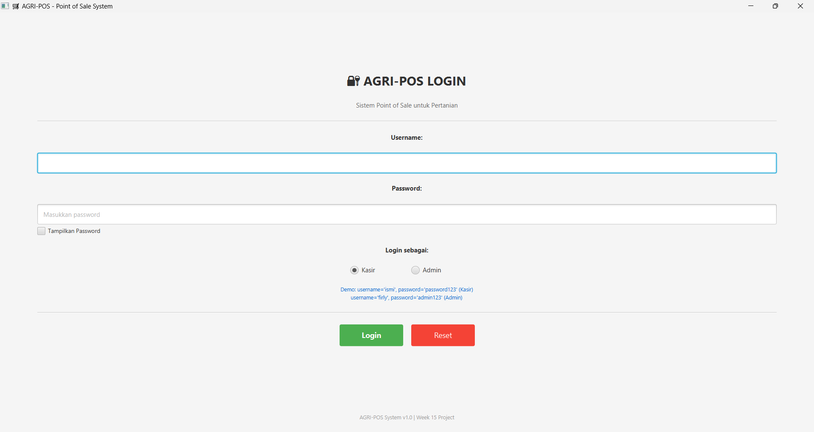
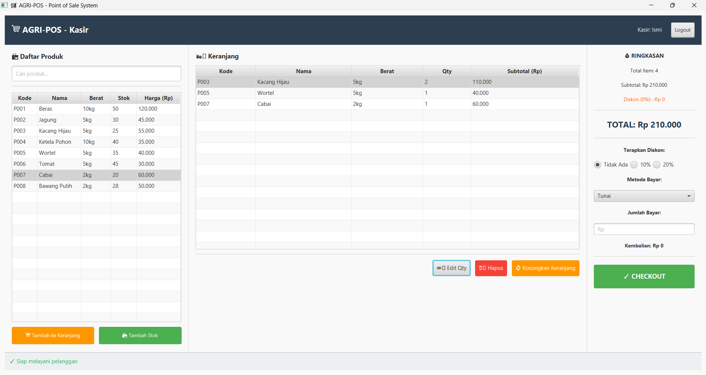
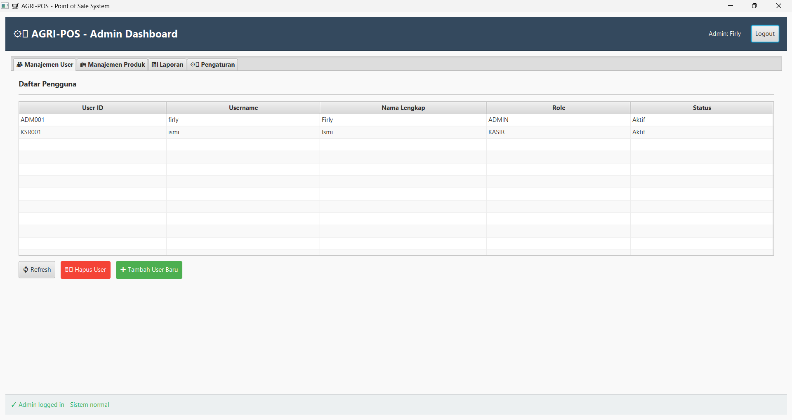
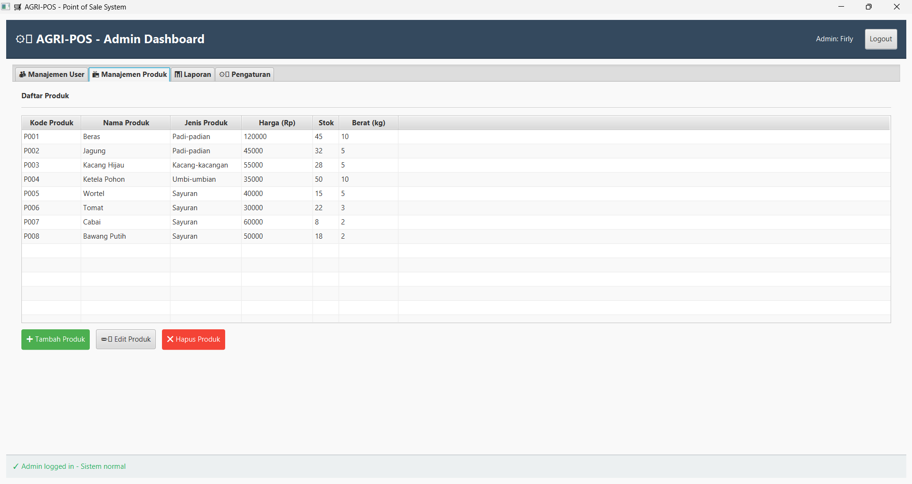
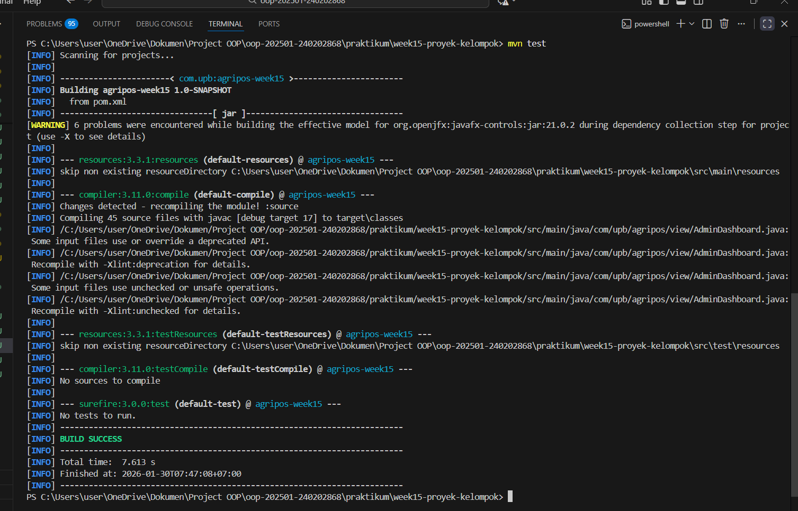

# Laporan Praktikum Minggu 15 
Topik: Proyek Kelompok (Desain Sistem + Implementasi Terintegrasi + Testing + Dokumentasi)

## Identitas
- Nama  : Ismi Nur Fadilah
- NIM   : 240202868
- Kelas : 3IKRB

---

## Tujuan

Tujuan dari proyek ini adalah:
  - Mengembangkan aplikasi Java terintegrasi secara kolaboratif.
  - Mendesain sistem menggunakan UML (Use Case, Class, dan Sequence Diagram).
  - Menerapkan arsitektur berlapis (View–Controller–Service–DAO–DB) sesuai prinsip SOLID dan DIP.
  - Melakukan pengujian sistem menggunakan test plan dan unit test.
  - Menyusun dokumentasi teknis dan laporan proyek secara lengkap.
---

## Dasar Teori

  1. Arsitektur Berlapis (Layered Architecture)
     Sistem dibagi ke dalam beberapa lapisan yaitu View, Controller, Service, DAO, dan Database untuk memisahkan tanggung jawab dan mempermudah pengembangan.

  2. Unified Modeling Language (UML)
     UML digunakan untuk memodelkan kebutuhan, struktur, dan alur sistem melalui Use Case, Class, dan Sequence Diagram.

  3. Prinsip SOLID
     Prinsip SOLID diterapkan agar kode lebih terstruktur, mudah dipelihara, dan mudah dikembangkan.

   4. Pengujian Perangkat Lunak
      Pengujian dilakukan untuk memastikan sistem berjalan sesuai kebutuhan melalui pengujian manual dan unit test.

---

## Langkah Praktikum

  1. Persiapan Proyek
     Menyalin (clone) base code Agri-POS dari praktikum Bab 14 sebagai dasar pengembangan proyek kelompok, kemudian mengatur struktur direktori sesuai ketentuan.

  2. Perancangan Sistem
     Menyusun desain sistem menggunakan UML yang meliputi Use Case Diagram, Class Diagram, dan Sequence Diagram sesuai kebutuhan fungsional.

  3. Implementasi Sistem
     Mengembangkan aplikasi secara terintegrasi dengan menerapkan arsitektur berlapis (View–Controller–Service–DAO–Database) menggunakan JavaFX, JDBC, dan PostgreSQL.

  4. Pengujian Sistem
     Melakukan pengujian manual pada fitur utama serta menjalankan unit test menggunakan JUnit untuk logika non-UI.

  5. Dokumentasi dan Versi Kontrol
     Menyusun dokumentasi proyek dalam bentuk laporan dan melakukan kolaborasi menggunakan GitHub dengan commit yang bermakna dari setiap anggota.

---

## Kode Program

Contoh Kode Program Utama
1. Controller
   ProductController.java

```java
package com.upb.agripos.controller;

import com.upb.agripos.model.Product;
import com.upb.agripos.service.ProductService;
import javafx.collections.FXCollections;
import javafx.collections.ObservableList;

public class ProductController {
    private ProductService productService;
    private ObservableList<Product> productList;

    public ProductController(ProductService productService) {
        this.productService = productService;
        this.productList = FXCollections.observableArrayList();
        loadProducts(); // Load initial data
    }

    // Load products from database
    public void loadProducts() {
        productList.clear();
        productList.addAll(productService.getAllProducts());
    }

    // Add new product
    public boolean addProduct(String code, String name, String category, String priceStr, String stockStr) {
        try {
            // Parse input
            double price = Double.parseDouble(priceStr);
            int stock = Integer.parseInt(stockStr);

            // Create product object
            Product product = new Product(code, name, category, price, stock);

            // Add through service
            boolean success = productService.addProduct(product);
            
            if (success) {
                loadProducts(); // Refresh list
            }
            
            return success;
        } catch (NumberFormatException e) {
            System.out.println("Error: Format angka tidak valid!");
            return false;
        }
    }

    // Get observable list for ListView binding
    public ObservableList getProductList() {
        return productList;
    }

    // Get product by code
    public Product getProductByCode(String code) {
        return productService.getProductByCode(code);
    }

    // Delete product
    public boolean deleteProduct(String code) {
        boolean success = productService.deleteProduct(code);
        if (success) {
            loadProducts();
        }
        return success;
    }

    // Tambah stok produk secara manual (untuk produk yang stoknya habis/0)
    public boolean addStockManually(String code, String additionalStockStr) {
        try {
            // Validasi input
            if (code == null || code.trim().isEmpty()) {
                System.out.println("Error: Kode produk tidak boleh kosong!");
                return false;
            }

            int additionalStock = Integer.parseInt(additionalStockStr);

            // Panggil service untuk menambah stok
            boolean success = productService.addStock(code, additionalStock);
            
            if (success) {
                loadProducts(); // Refresh list setelah penambahan stok
            }
            
            return success;
        } catch (NumberFormatException e) {
            System.out.println("Error: Jumlah stok harus berupa angka!");
            return false;
        }
    }

    // Cek apakah produk stoknya habis
    public boolean isOutOfStock(String code) {
        return productService.isOutOfStock(code);
    }

    // Cek apakah stok produk di bawah batas minimum
    public boolean isLowStock(String code, int minStock) {
        return productService.isLowStock(code, minStock);
    }

    // Update product dengan stok baru
    public boolean updateProductWithStock(String code, String stockStr) {
        try {
            Product product = productService.getProductByCode(code);
            if (product == null) {
                System.out.println("Error: Produk tidak ditemukan!");
                return false;
            }

            int newStock = Integer.parseInt(stockStr);
            if (newStock < 0) {
                System.out.println("Error: Stok tidak boleh negatif!");
                return false;
            }

            product.setStock(newStock);
            boolean success = productService.updateProduct(product);
            
            if (success) {
                loadProducts(); // Refresh list
            }
            
            return success;
        } catch (NumberFormatException e) {
            System.out.println("Error: Stok harus berupa angka!");
            return false;
        }
    }
}
```

2. AppJavaFX.java
```java
package com.upb.agripos;

import com.upb.agripos.controller.AuthController;
import com.upb.agripos.service.AuthServiceImpl;
import com.upb.agripos.service.ProductService;
import com.upb.agripos.util.DatabaseConnection;
import com.upb.agripos.view.AdminDashboard;
import com.upb.agripos.view.LoginView;
import com.upb.agripos.view.PosView;
import javafx.application.Application;
import javafx.scene.Scene;
import javafx.stage.Stage;
import java.sql.Connection;
import com.upb.agripos.db.DBConnection;


/**
 * Main Application Entry Point - Week 15 Collaborative Project
 * Person D - Frontend/UI Layer
 * 
 * Features:
 * - Authentication dengan LoginView
 * - Role-based routing (KASIR -> PosView, ADMIN -> AdminDashboard)
 * - Service layer integration
 */
public class AppJavaFX extends Application {
    
    private Stage primaryStage;
    private AuthController authController;
    
    @Override
    public void start(Stage primaryStage) {
        this.primaryStage = primaryStage;
        
        System.out.println("=".repeat(70));
        System.out.println("AGRI-POS System - Point of Sale untuk Pertanian");
        System.out.println("Week 15 - Collaborative Project");
        System.out.println("Person D - Frontend/UI");
        System.out.println("=".repeat(70));
        
        try {
            // Initialize AuthService
            AuthServiceImpl authService = new AuthServiceImpl();
            
            // Initialize AuthController
            authController = new AuthController(authService);
            System.out.println("✓ AuthController initialized");
            
            // Setup primary stage
            primaryStage.setTitle("🛒 AGRI-POS - Point of Sale System");
            primaryStage.setWidth(1200);
            primaryStage.setHeight(800);
            
            // Show LoginView first
            showLoginView();
            
            primaryStage.show();
            System.out.println("✓ Application started successfully");
            System.out.println("=".repeat(70));
            
        } catch (Exception e) {
            System.err.println("✗ Error initializing application:");
            e.printStackTrace();
        }
    }
    
    /**
     * Display LoginView
     */
    private void showLoginView() {
        LoginView loginView = new LoginView(primaryStage, authController);
        LoginView.setNavCallback((user) -> {
            if (user.isAdmin()) {
                showAdminDashboard();
            } else {
                showPosView();
            }
        });
        Scene scene = loginView.createScene();
        primaryStage.setScene(scene);
        System.out.println("→ LoginView displayed");
    }
    
    /**
     * Display PosView untuk KASIR
     */
    private void showPosView() {
        try {
            System.out.println("[NAV] showPosView() called");
            System.out.println("[NAV] Current user: " + (authController.getCurrentUser() != null ? authController.getCurrentUser().getFullName() : "NULL"));
            
            ProductService productService = null;
            
            // Try to get database connection and create ProductService
            try {
                System.out.println("[NAV] Getting database connection...");
                Connection connection = DatabaseConnection.getInstance().getConnection();
                System.out.println("[NAV] Connection obtained: " + (connection != null ? "SUCCESS" : "NULL"));
                
                if (connection != null) {
                    productService = new ProductService(connection);
                    System.out.println("[NAV] ProductService created");
                }
            } catch (Exception dbException) {
                System.err.println("[NAV] Database connection failed: " + dbException.getMessage());
                System.err.println("[NAV] Continuing without ProductService (database unavailable)");
            }
            
            // Create PosView and inject ProductService if available
            PosView posView = new PosView(primaryStage, authController);
            if (productService != null) {
                posView.setProductService(productService);
                System.out.println("[NAV] ProductService injected into PosView");
            }
            
            PosView.setNavCallback(() -> showLoginView());
            System.out.println("[NAV] Creating PosView scene...");
            Scene scene = posView.createScene();
            System.out.println("[NAV] Setting scene to primaryStage...");
            primaryStage.setScene(scene);
            
            String userName = authController.getCurrentUser() != null ? authController.getCurrentUser().getFullName() : "Unknown";
            System.out.println("✓ PosView displayed for: " + userName);
        } catch (Exception e) {
            System.err.println("✗ Error displaying PosView: " + e.getMessage());
            System.err.println("✗ Full error:");
            e.printStackTrace();
            // Fallback: show LoginView
            showLoginView();
        }
    }
    
    /**
     * Display AdminDashboard untuk ADMIN
     */
    private void showAdminDashboard() {
        try {
            System.out.println("[NAV] showAdminDashboard() called");
            System.out.println("[NAV] Current user: " + (authController.getCurrentUser() != null ? authController.getCurrentUser().getFullName() : "NULL"));
            
            ProductService productService = null;
            
            // Try to get database connection and create ProductService
            try {
                System.out.println("[NAV] Getting database connection...");
                Connection connection = DatabaseConnection.getInstance().getConnection();
                System.out.println("[NAV] Connection obtained: " + (connection != null ? "SUCCESS" : "NULL"));
                
                if (connection != null) {
                    productService = new ProductService(connection);
                    System.out.println("[NAV] ProductService created");
                }
            } catch (Exception dbException) {
                System.err.println("[NAV] Database connection failed: " + dbException.getMessage());
                System.err.println("[NAV] Continuing without ProductService (database unavailable)");
            }
            
            // Create AdminDashboard and inject ProductService if available
            AdminDashboard adminDashboard = new AdminDashboard(primaryStage, authController);
            if (productService != null) {
                adminDashboard.setProductService(productService);
                System.out.println("[NAV] ProductService injected into AdminDashboard");
            }
            
            AdminDashboard.setNavCallback(() -> showLoginView());
            System.out.println("[NAV] Creating AdminDashboard scene...");
            Scene scene = adminDashboard.createScene();
            System.out.println("[NAV] Setting scene to primaryStage...");
            primaryStage.setScene(scene);
            
            String userName = authController.getCurrentUser() != null ? authController.getCurrentUser().getFullName() : "Unknown";
            System.out.println("✓ AdminDashboard displayed for: " + userName);
        } catch (Exception e) {
            System.err.println("✗ Error displaying AdminDashboard: " + e.getMessage());
            System.err.println("✗ Full error:");
            e.printStackTrace();
            // Fallback: show LoginView
            showLoginView();
        }
    }
    
    /**
     * Main entry point
     */
    public static void main(String[] args) {
        launch(args);
    }
}
```

3. ProductService.java

```java
package com.upb.agripos.service;

import com.upb.agripos.dao.ProductDAO;
import com.upb.agripos.dao.ProductDAOImpl;
import com.upb.agripos.model.Product;
import java.sql.Connection;
import java.util.List;

public class ProductService {
    private ProductDAO productDAO;

    public ProductService(Connection connection) {
        this.productDAO = new ProductDAOImpl(connection);
    }

    // Business Logic: Insert Product dengan validasi
    public boolean addProduct(Product product) {
        // Validasi: Cek apakah kode sudah ada
        Product existing = productDAO.findById(product.getCode());
        if (existing != null) {
            System.out.println("Error: Kode produk sudah ada!");
            return false;
        }

        // Validasi: Harga dan stok tidak boleh negatif
        if (product.getPrice() < 0) {
            System.out.println("Error: Harga tidak boleh negatif!");
            return false;
        }

        if (product.getStock() < 0) {
            System.out.println("Error: Stok tidak boleh negatif!");
            return false;
        }

        // Insert ke database
        return productDAO.insert(product);
    }

    // Get all products
    public List getAllProducts() {
        return productDAO.findAll();
    }

    // Find by code
    public Product getProductByCode(String code) {
        return productDAO.findById(code);
    }

    // Update product
    public boolean updateProduct(Product product) {
        // Validasi sebelum update
        if (product.getPrice() < 0 || product.getStock() < 0) {
            System.out.println("Error: Harga dan stok tidak boleh negatif!");
            return false;
        }
        return productDAO.update(product);
    }

    // Delete product
    public boolean deleteProduct(String code) {
        return productDAO.delete(code);
    }

    // Penambahan stok manual (untuk produk yang habis/stok 0)
    public boolean addStock(String code, int additionalStock) {
        // Validasi stok yang ditambahkan harus positif
        if (additionalStock <= 0) {
            System.out.println("Error: Jumlah stok yang ditambahkan harus lebih dari 0!");
            return false;
        }

        // Cari produk berdasarkan kode
        Product product = productDAO.findById(code);
        if (product == null) {
            System.out.println("Error: Produk dengan kode " + code + " tidak ditemukan!");
            return false;
        }

        // Update stok produk
        int newStock = product.getStock() + additionalStock;
        product.setStock(newStock);

        // Update ke database
        boolean success = productDAO.update(product);
        if (success) {
            System.out.println("Stok produk " + product.getName() + " berhasil ditambahkan!");
            System.out.println("Stok lama: " + (product.getStock() - additionalStock) + 
                             " → Stok baru: " + newStock);
        }
        return success;
    }

    // Cek apakah produk stoknya habis (0)
    public boolean isOutOfStock(String code) {
        Product product = productDAO.findById(code);
        return product != null && product.getStock() == 0;
    }

    // Cek apakah stok produk di bawah batas minimum (misal: < 10)
    public boolean isLowStock(String code, int minStock) {
        Product product = productDAO.findById(code);
        return product != null && product.getStock() < minStock;
    }
}
```

4. ProductDAO.java
```java
package com.upb.agripos.dao;

import com.upb.agripos.model.Product;
import java.sql.*;
import java.util.ArrayList;
import java.util.List;

/**
 * ProductDAO Interface & Base Implementation
 * Person A - DATABASE MASTER
 * 
 * Interface untuk operasi CRUD Product
 * Implementasi menggunakan JDBC dengan connection pooling
 */
public interface ProductDAO {
    
    /**
     * Insert product baru
     */
    boolean insert(Product product);
    
    /**
     * Update product yang sudah ada
     */
    boolean update(Product product);
    
    /**
     * Delete product berdasarkan ID
     */
    boolean delete(String productId);
    
    /**
     * Cari product berdasarkan ID
     */
    Product findById(String productId);
    
    /**
     * Ambil semua product
     */
    List<Product> findAll();
}
```
---

## Hasil Eksekusi

  1. Login


  2. Dashboard Kasir


  3. Dashboard Admin


  4. Manajemen Produk 


  5. Laporan Penjualan


  6. Hasil Maven Test


---

## Analisis

Kode program berjalan dengan menerapkan arsitektur berlapis. Interaksi pengguna pada antarmuka (JavaFX) ditangani oleh Controller, kemudian diteruskan ke Service untuk diproses sebagai logika bisnis. Selanjutnya, Service memanggil DAO untuk melakukan akses data ke database PostgreSQL. Hasil pemrosesan dikembalikan secara berurutan dari DAO ke Service, Controller, lalu ditampilkan kembali pada tampilan (View).

Pendekatan ini membuat alur program lebih terstruktur, mudah dipelihara, dan memisahkan tampilan dari logika bisnis serta akses data.

---

## Kontribusi Kelompok

Peran utama yang saya jalankan adalah sebagai Backend Service Developer. Kontribusi difokuskan pada pengembangan dan pengelolaan layer Service yang menangani logika bisnis utama aplikasi Agri-POS.

Kontribusi yang dilakukan meliputi pengembangan ProductService untuk mengelola proses bisnis manajemen produk, seperti validasi data, pengolahan aturan bisnis, serta penghubung antara Controller dan DAO. Selain itu, dilakukan implementasi DiscountStrategy (OFR-2) dengan menerapkan pola desain Strategy untuk mendukung perhitungan diskon secara fleksibel tanpa mengubah kode inti sistem.

Kontribusi lainnya mencakup perancangan dan implementasi business logic pada proses transaksi, termasuk perhitungan total belanja dan penerapan aturan diskon. Seluruh pengembangan dilakukan dengan tetap mengikuti arsitektur berlapis, prinsip SOLID, serta memastikan bahwa logika bisnis tidak ditempatkan pada layer antarmuka (GUI).

## Kesimpulan

Berdasarkan praktikum Week 15, dapat disimpulkan bahwa pengembangan aplikasi Agri-POS berhasil dilakukan secara terintegrasi dengan menerapkan arsitektur berlapis, prinsip SOLID, serta pemodelan sistem menggunakan UML. Sistem yang dibangun mampu memenuhi kebutuhan fungsional utama, didukung oleh pengujian dasar dan dokumentasi yang rapi sehingga aplikasi siap untuk didemonstrasikan dan dikembangkan lebih lanjut.
---

