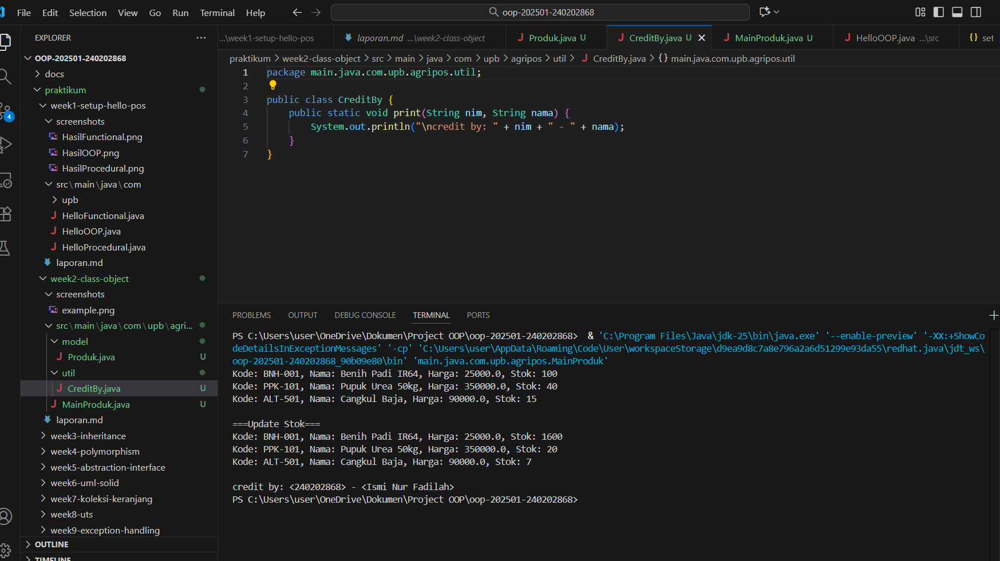
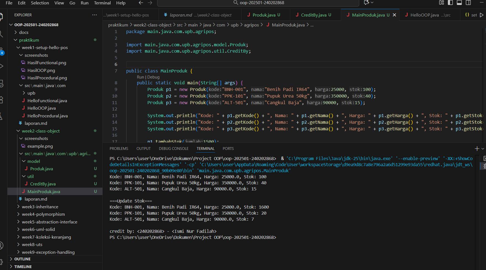
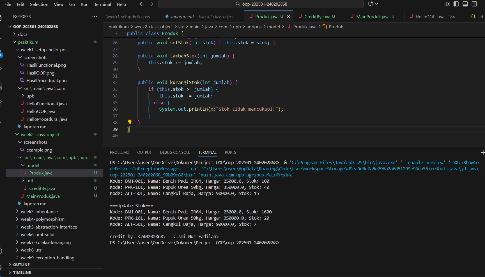

# Laporan Praktikum Minggu 2 
Topik: [Class dan Object (Produk Pertanian)]

## Identitas
- Nama  : [Ismi Nur Fadilah]
- NIM   : [240202868]
- Kelas : [3IKRB]

---

## Tujuan
 *Mahasiswa memahami konsep class dan object pada pemrograman berorientasi objek serta dapat mengimplementasikannya dalam bentuk class Produk dengan enkapsulasi dan pembuatan objek pada program utama.*)

---

## Dasar Teori
   1. Class adalah blueprint/template untuk membuat objek dalam OOP.

   2. Object adalah instansiasi dari class yang memiliki data (atribut) dan perilaku (method).

   3. Enkapsulasi adalah pembungkusan atribut sehingga tidak dapat diakses langsung dari luar, menggunakan access modifier seperti private.

   4. Getter dan Setter digunakan untuk membaca dan memodifikasi atribut secara terkontrol.

   5. Method pada class memungkinkan objek memiliki perilaku, misal menambah atau mengurangi stok produk.
---

## Langkah Praktikum
1. Membuat Class Produk
   - Buat file Produk.java pada package model.
   - Tambahkan atribut: kode, nama, harga, dan stok.
   - Gunakan enkapsulasi dengan menjadikan atribut bersifat private dan membuat getter serta setter untuk masing-masing atribut.

2. Membuat Class CreditBy
   - Buat file CreditBy.java pada package util.
   - Isi class dengan method statis untuk menampilkan identitas mahasiswa di akhir output: credit by: <NIM> - <Nama>.
   - Membuat Objek Produk dan Menampilkan Credit

3. Buat file MainProduk.java.
   - Instansiasi minimal tiga objek produk, misalnya "Benih Padi", "Pupuk Urea", dan satu produk alat pertanian.
   - Tampilkan informasi produk melalui method getter.
   - Panggil CreditBy.print("<NIM>", "<Nama>") di akhir main untuk menampilkan identitas.

4. Commit dan Push
   Commit dengan pesan: week2-class-object.

---

## Kode Program
1. Produk

```java
package main.java.com.upb.agripos.model;

public class Produk {
    private String kode;
    private String nama;
    private double harga;
    private int stok;

    public Produk(String kode, String nama, double harga, int stok) {
        this.kode = kode;
        this.nama = nama;
        this.harga = harga;
        this.stok = stok;
    }

    public String getKode() { return kode; }
    public void setKode(String kode) { this.kode = kode; }

    public String getNama() { return nama; }
    public void setNama(String nama) { this.nama = nama; }

    public double getHarga() { return harga; }
    public void setHarga(double harga) { this.harga = harga; }

    public int getStok() { return stok; }
    public void setStok(int stok) { this.stok = stok; }

    public void tambahStok(int jumlah) {
        this.stok += jumlah;
    }

    public void kurangiStok(int jumlah) {
        if (this.stok >= jumlah) {
            this.stok -= jumlah;
        } else {
            System.out.println("Stok tidak mencukupi!");
        }
    }
}

```
2. Credit By

```java
package main.java.com.upb.agripos.util;

public class CreditBy {
    public static void print(String nim, String nama) {
        System.out.println("\ncredit by: " + nim + " - " + nama);
    }
}
```
3. Main Produk

```java
package main.java.com.upb.agripos;

import main.java.com.upb.agripos.model.Produk;
import main.java.com.upb.agripos.util.CreditBy;


public class MainProduk {
    public static void main(String[] args) {
        Produk p1 = new Produk("BNH-001", "Benih Padi IR64", 25000, 100);
        Produk p2 = new Produk("PPK-101", "Pupuk Urea 50kg", 350000, 40);
        Produk p3 = new Produk("ALT-501", "Cangkul Baja", 90000, 15);

        System.out.println("Kode: " + p1.getKode() + ", Nama: " + p1.getNama() + ", Harga: " + p1.getHarga() + ", Stok: " + p1.getStok());
        System.out.println("Kode: " + p2.getKode() + ", Nama: " + p2.getNama() + ", Harga: " + p2.getHarga() + ", Stok: " + p2.getStok());
        System.out.println("Kode: " + p3.getKode() + ", Nama: " + p3.getNama() + ", Harga: " + p3.getHarga() + ", Stok: " + p3.getStok());

        p1.tambahStok(1500);
        p2.kurangiStok(20);
        p3.kurangiStok(8);


        System.out.println("\n===Update Stok===");
        System.out.println("Kode: " + p1.getKode() + ", Nama: " + p1.getNama() + ", Harga: " + p1.getHarga() + ", Stok: " + p1.getStok());
        System.out.println("Kode: " + p2.getKode() + ", Nama: " + p2.getNama() + ", Harga: " + p2.getHarga() + ", Stok: " + p2.getStok());
        System.out.println("Kode: " + p3.getKode() + ", Nama: " + p3.getNama() + ", Harga: " + p3.getHarga() + ", Stok: " + p3.getStok());

        CreditBy.print("<240202868>", "<Ismi Nur Fadilah>");
    }
}
```
)
---

## Hasil Eksekusi
(Sertakan screenshot hasil eksekusi program.  



)
---

## Analisis
(
Program berjalan sesuai konsep OOP. Class Produk menyimpan data dan method untuk manipulasi stok. Di MainProduk, dibuat tiga object produk dengan nilai berbeda dan dilakukan operasi penambahan dan pengurangan stok. Output mencerminkan perubahan nilai atribut objek.

Pendekatan minggu ini lebih terstruktur dibanding pendekatan procedural karena data produk dibungkus dalam satu class, sehingga mudah digunakan berulang dan dikembangkan lebih lanjut untuk sistem POS.

Tidak ada error besar, hanya perlu memastikan import path benar sesuai struktur package.
)
---

## Kesimpulan
 *Dengan menerapkan class dan object, program menjadi lebih terstruktur, reusable, dan mudah dikembangkan ke level aplikasi yang lebih kompleks seperti sistem POS. Enkapsulasi menjaga integritas data agar tidak diakses atau dimodifikasi secara langsung tanpa kontrol.*)

---

## Quiz
(1. [Mengapa atribut sebaiknya dideklarasikan sebagai private dalam class?]  
   **Jawaban:** Untuk menerapkan enkapsulasi sehingga data tidak bisa diakses langsung dari luar class dan mencegah perubahan data tanpa kontrol.

2. [Apa fungsi getter dan setter dalam enkapsulasi?]  
   **Jawaban:** Getter digunakan untuk membaca nilai atribut dan setter digunakan untuk mengubah nilai atribut secara aman dengan validasi jika diperlukan. 

3. [Bagaimana cara class Produk mendukung pengembangan aplikasi POS yang lebih kompleks?]  
   **Jawaban:** Class Produk menjadi fondasi data item pada POS; dengan blueprint ini, sistem dapat menambahkan transaksi, update stok otomatis, integrasi database, dan pelaporan tanpa mengubah struktur dasar. )
