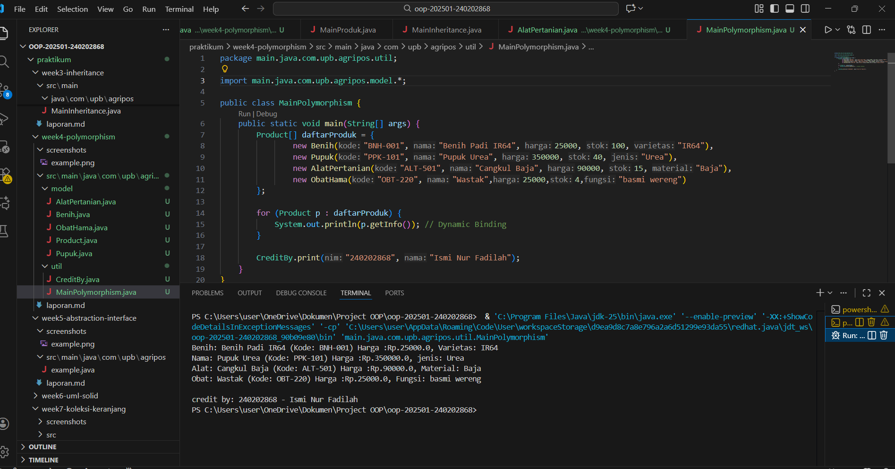

# Laporan Praktikum Minggu 4 
Topik: [Polymorphism (Info Produk)]

## Identitas
- Nama  : [Ismi Nur Fadilah]
- NIM   : [240202868]
- Kelas : [3IKRB]

---

## Tujuan
 - menjelaskan konsep polymorphism dalam OOP.
 - membedakan method overloading dan overriding.
 - mampu mengimplementasikan polymorphism (overriding, overloading, dynamic binding) dalam program.
 - mampu menganalisis contoh kasus polymorphism pada sistem nyata (Agri-POS).

---

## Dasar Teori
Polymorphism berarti “banyak bentuk” dan memungkinkan objek yang berbeda merespons panggilan method yang sama dengan cara yang berbeda.

1. Overloading → mendefinisikan method dengan nama sama tetapi parameter berbeda.
2. Overriding → subclass mengganti implementasi method dari superclass.
3. Dynamic Binding → pemanggilan method ditentukan saat runtime, bukan compile time.

Dalam konteks Agri-POS, misalnya:
  - Method getInfo() pada Produk dioverride oleh Benih, Pupuk, AlatPertanian untuk menampilkan detail spesifik.
  - Method tambahStok() bisa dibuat overload dengan parameter berbeda (int, double).

---

## Langkah Praktikum
1. Overloading
   Tambahkan method tambahStok(int jumlah) dan tambahStok(double jumlah) pada class Produk.

2. Overriding
   - Tambahkan method getInfo() pada superclass Produk.
   - Override method getInfo() pada subclass Benih, Pupuk, dan AlatPertanian.

3. Dynamic Binding
   - Buat array Produk[] daftarProduk yang berisi objek Benih, Pupuk, dan AlatPertanian.
   - Loop array tersebut dan panggil getInfo(). Perhatikan bagaimana Java memanggil method sesuai jenis objek aktual.

4. Main Class
   Buat MainPolymorphism.java untuk mendemonstrasikan overloading, overriding, dan dynamic binding.

5. CreditBy
   Tetap panggil CreditBy.print("<NIM>", "<Nama>").

6. Commit dan Push
   Commit dengan pesan: week4-polymorphism.


---

## Kode Program

1. Alat Pertanian

```java
package main.java.com.upb.agripos.model;

public class AlatPertanian extends Product{

    private String material;

    public AlatPertanian(String kode, String nama, double harga, int stok, String material) {
        super(kode, nama, harga, stok);
        this.material = material;
    }

    @Override
    public String getInfo() {
        return "Alat: "+  super.getInfo() + ", Material: " + material ;
    }
}
```

2. Benih

```java
package main.java.com.upb.agripos.model;

public class Benih extends  Product{

    private String varietas;

    public Benih(String kode, String nama, double harga, int stok, String varietas) {
        super(kode, nama, harga, stok);
        this.varietas = varietas;
    }

    @Override
    public String getInfo() {
        return "Benih: " + super.getInfo() + ", Varietas: " + varietas;
    }
}
```

3. Obat Hama

```java
package main.java.com.upb.agripos.model;

public class ObatHama extends Product{

    String fungsi;

    public ObatHama(String kode, String nama, double harga, int stok, String fungsi) {
        super(kode, nama, harga, stok);
        this.fungsi = fungsi;
    }

    @Override
    public String getInfo() {
        return "Obat: " + super.getInfo() + ", Fungsi: " + fungsi;
    }
}
```

4. Product

```java
package main.java.com.upb.agripos.model;

public class Product {
    private String kode;
    private String nama;
    private double harga;
    private int stok;

    public Product(String kode, String nama, double harga, int stok) {
        this.kode = kode;
        this.nama = nama;
        this.harga = harga;
        this.stok = stok;
    }

    public void tambahStok(int jumlah) {
        this.stok += jumlah;
    }

    public void kurangiStok(int jumlah) {
        if (this.stok >= jumlah) {
            this.stok -= jumlah;
        } else {
            System.out.println("Stok tidak mencukupi!");
        }
    }
    public String getInfo() {
        return nama + " (Kode: " + kode + ")" + " Harga :" + "Rp." + Double.toString(harga);
    }
}
```

5. Pupuk

```java
package main.java.com.upb.agripos.model;

public class Pupuk extends  Product{

    private String jenis;

    public Pupuk(String kode, String nama, double harga, int stok, String jenis) {
        super(kode, nama, harga, stok);
        this.jenis = jenis;
    }

    @Override
    public String getInfo() {
        return "Nama: " + super.getInfo() + ", jenis: " + jenis;
    }
}
```

6. Credit By

```java
package main.java.com.upb.agripos.util;

public class CreditBy {
    public static void print(String nim, String nama) {
        System.out.println("\ncredit by: " + nim + " - " + nama);
    }
}
```

7. Main Polymorphism

```java
package main.java.com.upb.agripos.util;

import main.java.com.upb.agripos.model.*;

public class MainPolymorphism {
    public static void main(String[] args) {
        Product[] daftarProduk = {
                new Benih("BNH-001", "Benih Padi IR64", 25000, 100, "IR64"),
                new Pupuk("PPK-101", "Pupuk Urea", 350000, 40, "Urea"),
                new AlatPertanian("ALT-501", "Cangkul Baja", 90000, 15, "Baja"),
                new ObatHama("OBT-220", "Wastak",25000,4,"basmi wereng")
        };

        for (Product p : daftarProduk) {
            System.out.println(p.getInfo()); // Dynamic Binding
        }

        CreditBy.print("240202868", "Ismi Nur Fadilah");
    }
}
```
)
---

## Hasil Eksekusi
(Sertakan screenshot hasil eksekusi program.  

)
---

## Analisis
(
Pada praktikum minggu ini, program menampilkan penerapan polymorphism melalui kombinasi overloading, overriding, dan dynamic binding. Program dimulai dari pembuatan beberapa objek yang merupakan turunan dari class Product, yaitu Benih, Pupuk, AlatPertanian, dan ObatHama. Semua objek tersebut dimasukkan ke dalam array bertipe Product[], sehingga meskipun setiap objek merupakan tipe berbeda, semuanya dapat diperlakukan sebagai Product.

Ketika program melakukan loop dan memanggil p.getInfo(), Java tidak menggunakan versi method dari superclass, tetapi memilih method getInfo() milik objek asli (subclass). Inilah konsep dynamic binding, di mana method yang dipanggil ditentukan saat runtime berdasarkan jenis objek sebenarnya, bukan tipe referensinya.

Perbedaan utama dibanding minggu sebelumnya yaitu:
  1. Minggu sebelumnya fokus pada inheritance (pewarisan class) saja, sedangkan minggu ini menekankan bahwa subclass tidak hanya mewarisi tetapi juga mengubah perilaku method lewat overriding.
  2. Selain itu, minggu ini juga mengenalkan konsep overloading method pada class Product untuk menambah stok dengan parameter berbeda.
  3. Minggu sebelumnya objek-objek dipanggil secara langsung, sedangkan minggu ini menggunakan array superclass untuk memperlihatkan sifat polymorphic.

Kendala yang dihadapi antara lain:
  - Nama method getInfo() tidak konsisten sehingga harus memastikan setiap subclass menggunakan @Override agar Java mengenali bahwa method tersebut mengganti method parent.
  - Penggunaan array polymorphism kadang membingungkan pemula karena objek tampak bertipe Product, tetapi sifat sebenarnya tetap mengikuti subclass.
  - Output yang kurang rapi karena sebagian subclass menambahkan teks yang berbeda-beda („Alat:“, „Benih:“, „Nama:“), sehingga perlu konsistensi.
)
---

## Kesimpulan
Pada praktikum minggu ini, mahasiswa berhasil memahami bahwa polymorphism memungkinkan objek-objek dengan tipe berbeda diperlakukan sebagai satu tipe induk namun tetap menjalankan perilaku spesifiknya masing-masing. Konsep overloading, overriding, dan dynamic binding membuat program lebih fleksibel, mudah dikembangkan, serta mendukung desain yang modular di dalam sistem berbasis OOP seperti Agri-POS.
---

## Quiz
(1. [Apa perbedaan overloading dan overriding?]  
   **Jawaban:** 
   - Overloading adalah mendefinisikan method dengan nama yang sama tetapi parameter berbeda dalam satu class. Terjadi pada compile time.
   - Overriding adalah mengganti implementasi method dari superclass di subclass dengan nama dan parameter yang sama. Terjadi pada runtime. 

2. [Bagaimana Java menentukan method mana yang dipanggil dalam dynamic binding?]  
   **Jawaban:** Dalam dynamic binding, Java menentukan method yang dipanggil berdasarkan tipe objek sebenarnya (object type), bukan tipe referensi. Pemilihan method dilakukan saat runtime, sehingga jika referensi bertipe Product, tetapi objeknya Benih, maka method milik Benih yang dijalankan.

3. [Berikan contoh kasus polymorphism dalam sistem POS selain produk pertanian.]  
   **Jawaban:** 
   - Class Pembayaran sebagai superclass, dengan subclass CashPayment, EwalletPayment, CreditCardPayment yang masing-masing override method prosesPembayaran().
   - Saat kasir memproses transaksi, sistem cukup memanggil pembayaran.prosesPembayaran() tanpa mengetahui jenis pembayaran yang digunakan.  )

