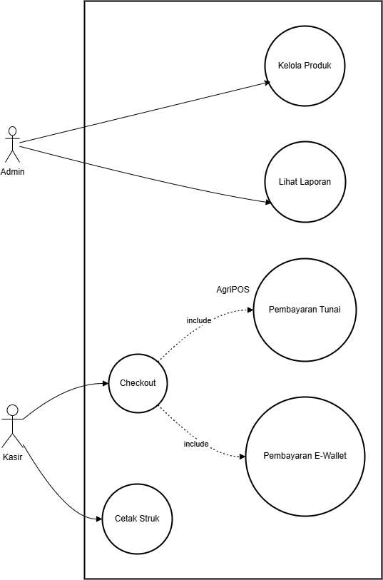
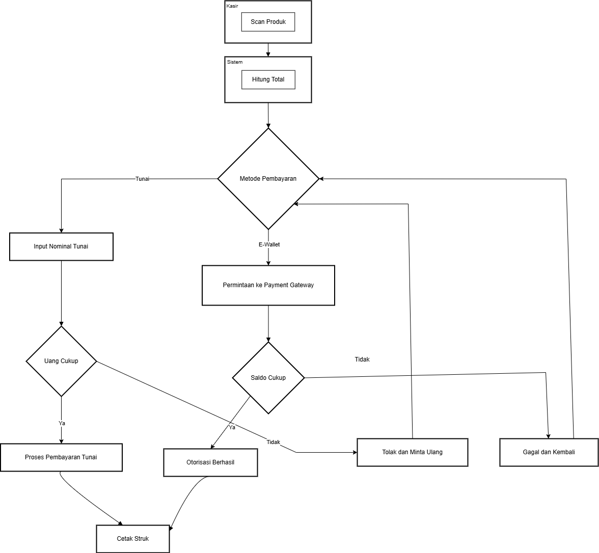
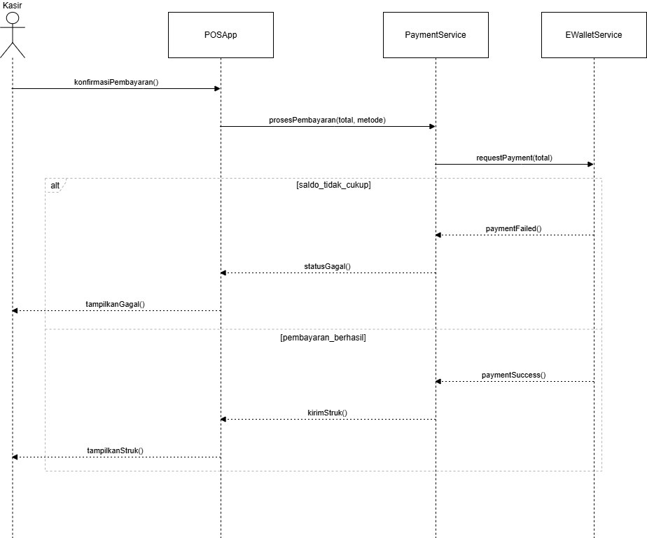

# Laporan Praktikum Minggu 6 
Topik: [Tuliskan judul topik, misalnya "Class dan Object"]

## Identitas
- Nama  : [Ismi Nur Fadilah]
- NIM   : [240202868]
- Kelas : [3IKRB]

---

## Tujuan
  - Mahasiswa mampu mengidentifikasi kebutuhan sistem ke dalam diagram UML.
  - Mahasiswa mampu menggambar UML Class Diagram dengan relasi antar class yang tepat.
  - Mahasiswa mampu menjelaskan prinsip desain OOP (SOLID).
  - Mahasiswa mampu menerapkan minimal dua prinsip SOLID dalam kode program.

---

## Deskripsi Sistem AgriPOS
AgriPOS merupakan sistem Point of Sale (POS) yang dirancang untuk mendukung proses transaksi penjualan produk pertanian, seperti benih tanaman, pupuk, serta perlengkapan dan alat pertanian. Sistem ini bertujuan untuk membantu pencatatan transaksi, pengelolaan produk, dan proses pembayaran secara terkomputerisasi agar lebih cepat dan akurat.

Dalam sistem AgriPOS terdapat dua aktor utama, yaitu:

  - Admin
    Bertanggung jawab dalam pengelolaan data produk serta melihat laporan transaksi penjualan.

  - Kasir
    Bertugas melakukan proses transaksi penjualan mulai dari pemindaian produk, checkout, hingga pembayaran dan pencetakan struk.

---

## Kebutuhan Fungsional Sistem
Kebutuhan fungsional yang didukung oleh sistem AgriPOS antara lain:
  1. Autentikasi pengguna (login) dan pengaturan hak akses
  2. Pengelolaan data produk
  3. Pemindaian dan pemilihan produk
  4. Proses checkout transaksi
  5. Pembayaran menggunakan metode tunai dan e-wallet
  6. Pencetakan struk transaksi

---

---

## 1. Perancangan Arsitektur Sistem Menggunakan UML
  Untuk menggambarkan struktur dan perilaku sistem AgriPOS, digunakan beberapa diagram UML yang saling melengkapi.

## 1.1  Use Case Diagram
Use Case Diagram digunakan untuk menunjukkan interaksi antara aktor dengan sistem.

Aktor:
 - Admin
 - Kasir

Use Case Utama:
 - Login
 - Kelola Produk
 - Scan Produk
 - Checkout Transaksi
 - Proses Pembayaran (Tunai dan E-Wallet)
 - Cetak Struk

Relasi UML:
 - Use case Checkout memiliki relasi include terhadap Cetak Struk
 - Pembayaran Tunai dan Pembayaran E-Wallet merupakan turunan dari use case Pembayaran (generalization)

Use Case Diagram memberikan gambaran umum fungsi yang dapat dijalankan oleh masing-masing aktor dalam sistem.

## 1.2 Activity Diagram – Proses Checkout
Activity Diagram menggambarkan alur aktivitas yang dilakukan oleh kasir saat memproses transaksi penjualan.
Alur aktivitas meliputi:
  - Kasir melakukan login
  - Kasir memindai produk
  - Sistem menambahkan produk ke dalam keranjang
  - Kasir memilih metode pembayaran
  - Sistem melakukan validasi pembayaran (tunai atau e-wallet)
  - Transaksi berhasil dan struk dicetak

Activity Diagram menggunakan swimlane untuk membedakan aktivitas yang dilakukan oleh:
  - Kasir
  - Sistem
  - Payment Gateway

## 1.3 Sequence Diagram – Proses Pembayaran
Sequence Diagram digunakan untuk menggambarkan urutan interaksi antar objek dalam proses pembayaran.
Urutan interaksi utama:
  - CheckoutService meminta data produk kepada ProductService
  - CheckoutService menentukan metode pembayaran
  - Sistem membuat objek PaymentMethod sesuai pilihan pengguna
  - Jika metode e-wallet dipilih, sistem berkomunikasi dengan Payment Gateway
  - Payment Gateway mengirimkan status transaksi
  - Sistem menyimpan data transaksi
  - Sistem menampilkan dan mencetak struk

Sequence Diagram membantu memahami alur komunikasi antar komponen secara kronologis.

## 1.4 Class Diagram
Class Diagram menggambarkan struktur kelas yang digunakan dalam sistem AgriPOS.
Kelas Domain:
  - Product
  - CartItem
  - Cart
  - Transaction

Kelas Service:
  - ProductService
  - CartService
  - CheckoutService

Kelas Pembayaran:
  - IPaymentMethod (interface)
  - CashPayment
  - EWalletPayment
  - PaymentGateway

Relasi Antar Kelas:
  - Composition antara Cart dan CartItem, serta Transaction dan CartItem
  - Association antara CheckoutService dan ProductService
  - Inheritance antara IPaymentMethod dengan CashPayment dan EWalletPayment
  - Dependency antara EWalletPayment dan PaymentGateway

Class Diagram menunjukkan penerapan konsep berorientasi objek dalam sistem.

---

## 2. Penerapan Prinsip SOLID
| Prinsip                               | Penjelasan                                         | Implementasi pada Sistem                                              |
| ------------------------------------- | -------------------------------------------------- | --------------------------------------------------------------------- |
| SRP (Single Responsibility Principle) | Setiap kelas memiliki satu tanggung jawab          | CartService hanya menangani logika keranjang                          |
| OCP (Open-Closed Principle)           | Sistem mudah dikembangkan tanpa mengubah kode lama | Penambahan metode pembayaran cukup membuat class baru                 |
| LSP (Liskov Substitution Principle)   | Subclass dapat menggantikan superclass             | CashPayment dan EWalletPayment dapat digunakan sebagai IPaymentMethod |
| ISP (Interface Segregation Principle) | Interface dibuat spesifik                          | IPaymentMethod hanya berisi metode pay()                              |
| DIP (Dependency Inversion Principle)  | Ketergantungan pada abstraksi                      | CheckoutService bergantung pada IPaymentMethod                        |

## Analisis
(
Berdasarkan perancangan sistem AgriPOS yang telah dilakukan, penggunaan diagram UML mampu menggambarkan kebutuhan fungsional serta alur kerja sistem secara jelas dan terstruktur. Use Case Diagram menjelaskan hubungan antara aktor dengan fungsi sistem, Activity Diagram menunjukkan alur proses checkout, Sequence Diagram menggambarkan interaksi antar komponen saat pembayaran, dan Class Diagram menjelaskan struktur kelas beserta relasinya.

Penerapan prinsip SOLID pada desain sistem membantu meningkatkan keterbacaan kode, kemudahan pemeliharaan, serta fleksibilitas sistem. Dengan menggunakan abstraksi melalui interface, sistem dapat dikembangkan lebih lanjut tanpa harus mengubah kelas inti, khususnya pada penambahan metode pembayaran baru.
)
---

## Kesimpulan
Perancangan arsitektur sistem AgriPOS menggunakan UML dan prinsip SOLID berhasil menghasilkan desain sistem yang terstruktur, modular, dan mudah dikembangkan. Setiap kebutuhan fungsional telah dipetakan dengan baik ke dalam diagram UML dan direalisasikan dalam bentuk kelas dan antarmuka yang saling terhubung.

Dengan pendekatan ini, sistem AgriPOS memiliki potensi untuk dikembangkan lebih lanjut, seperti penambahan metode pembayaran baru atau fitur laporan yang lebih kompleks, tanpa memerlukan perubahan besar pada desain awal. Hal ini menunjukkan bahwa penerapan UML dan prinsip SOLID sangat membantu dalam membangun sistem perangkat lunak yang berkualitas dan berkelanjutan.

---

## Quiz
(1. [Jelaskan perbedaan aggregation dan composition serta berikan contoh penerapannya pada desain Anda.]  
   **Jawaban:** Aggregation dan Composition merupakan bentuk relasi has-a dalam UML, namun memiliki perbedaan pada tingkat ketergantungan objek.

   - Aggregation
     Menunjukkan hubungan kepemilikan yang lemah, di mana objek dapat tetap ada meskipun objek induknya dihapus.
   - Composition
     Menunjukkan hubungan kepemilikan yang kuat, di mana objek tidak dapat berdiri sendiri tanpa objek induknya. 

2. [Bagaimana prinsip Open/Closed dapat memastikan sistem mudah dikembangkan?]  
   **Jawaban:** Prinsip Open/Closed Principle (OCP) menyatakan bahwa suatu kelas harus terbuka untuk pengembangan (extension) tetapi tertutup untuk perubahan (modification). Artinya, fitur baru dapat ditambahkan tanpa mengubah kode yang sudah ada.
   Penerapan pada AgriPOS:
   Pada sistem AgriPOS, metode pembayaran dirancang menggunakan interface IPaymentMethod. Jika di masa depan ingin menambahkan metode pembayaran baru seperti transfer bank atau QRIS, pengembang cukup membuat kelas baru yang mengimplementasikan IPaymentMethod tanpa mengubah kode pada CheckoutService atau PaymentService.
   Dengan demikian, risiko bug pada kode lama dapat diminimalkan dan sistem lebih mudah dikembangkan.

3. [Mengapa Dependency Inversion Principle (DIP) meningkatkan testability? Berikan contoh penerapannya.]  
   **Jawaban:** Dependency Inversion Principle (DIP) menyatakan bahwa modul tingkat tinggi tidak boleh bergantung pada modul tingkat rendah, melainkan bergantung pada abstraksi (interface). Hal ini meningkatkan testability karena ketergantungan konkret dapat digantikan dengan objek tiruan (mock).

   Contoh penerapan pada AgriPOS:
   CheckoutService tidak bergantung langsung pada CashPayment atau EWalletPayment, tetapi pada interface IPaymentMethod. Saat melakukan pengujian, pengembang dapat membuat mock payment yang mengimplementasikan IPaymentMethod tanpa harus benar-benar memanggil sistem pembayaran asli.
   Dengan pendekatan ini, proses pengujian menjadi lebih mudah, cepat, dan tidak bergantung pada sistem eksternal seperti payment gateway.)
