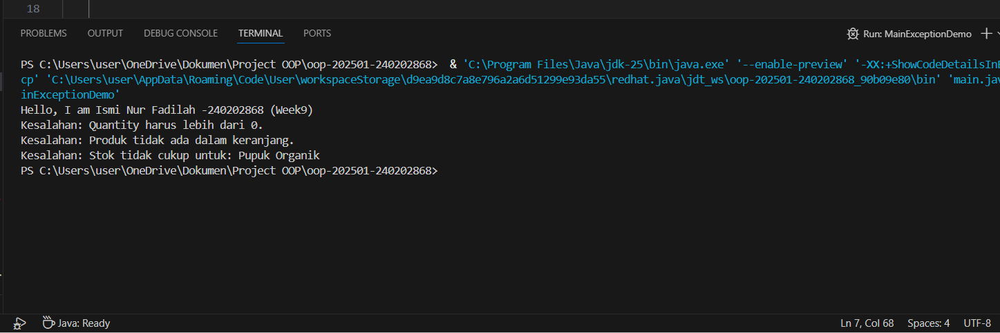

# Laporan Praktikum Minggu 9 
Topik: [Exception Handling, Custom Exception, dan Penerapan Design Pattern]

## Identitas
- Nama  : [Ismi Nur Fadilah]
- NIM   : [240202868]
- Kelas : [3IKRB]

---

## Tujuan
  - Menjelaskan perbedaan antara error dan exception.
  - Mengimplementasikan try–catch–finally dengan tepat.
  - Membuat custom exception sesuai kebutuhan program.
  - Mengintegrasikan exception handling ke dalam aplikasi sederhana (kasus keranjang belanja).
  - (Opsional) Menerapkan design pattern sederhana (Singleton/MVC) dan unit testing dasar.

---

## Dasar Teori
## 1. Error vs Exception
   - Error → kondisi fatal, tidak dapat ditangani (contoh: OutOfMemoryError).
   - Exception → kondisi tidak normal yang dapat ditangani oleh program.

## 2. Struktur try–catch–finally
```java
try {
    // kode yang berpotensi menimbulkan kesalahan
} catch (Exception e) {
    // penanganan
} finally {
    // blok yang selalu dijalankan
}
```

 ## 3. Membuat Custom Exception
 ```java
package com.upb.agripos;

public class InvalidQuantityException extends Exception {
    public InvalidQuantityException(String message) {
        super(message);
    }
}
```

---

## Langkah Praktikum
## 1. Membuat Custom Exception
```java
package com.upb.agripos;

public class InvalidQuantityException extends Exception {
    public InvalidQuantityException(String msg) { super(msg); }
}
package com.upb.agripos;

public class ProductNotFoundException extends Exception {
    public ProductNotFoundException(String msg) { super(msg); }
}
package com.upb.agripos;

public class InsufficientStockException extends Exception {
    public InsufficientStockException(String msg) { super(msg); }
}
```

## 2. Model Product dengan Stok
```java
package com.upb.agripos;

public class Product {
    private final String code;
    private final String name;
    private final double price;
    private int stock;

    public Product(String code, String name, double price, int stock) {
        this.code = code;
        this.name = name;
        this.price = price;
        this.stock = stock;
    }

    public String getCode() { return code; }
    public String getName() { return name; }
    public double getPrice() { return price; }
    public int getStock() { return stock; }
    public void reduceStock(int qty) { this.stock -= qty; }
}
```

## 3. Implementasi ShoppingCart dengan Exception Handling
```java
package com.upb.agripos;

import java.util.HashMap;
import java.util.Map;

public class ShoppingCart {
    private final Map<Product, Integer> items = new HashMap<>();

    public void addProduct(Product p, int qty) throws InvalidQuantityException {
        if (qty <= 0) {
            throw new InvalidQuantityException("Quantity harus lebih dari 0.");
        }
        items.put(p, items.getOrDefault(p, 0) + qty);
    }

    public void removeProduct(Product p) throws ProductNotFoundException {
        if (!items.containsKey(p)) {
            throw new ProductNotFoundException("Produk tidak ada dalam keranjang.");
        }
        items.remove(p);
    }

    public void checkout() throws InsufficientStockException {
        for (Map.Entry<Product, Integer> entry : items.entrySet()) {
            Product product = entry.getKey();
            int qty = entry.getValue();
            if (product.getStock() < qty) {
                throw new InsufficientStockException(
                    "Stok tidak cukup untuk: " + product.getName()
                );
            }
        }
        // contoh pengurangan stok bila semua cukup
        for (Map.Entry<Product, Integer> entry : items.entrySet()) {
            entry.getKey().reduceStock(entry.getValue());
        }
    }
}
```

## 4. Main Program untuk Menguji Exception Handling
```java
package com.upb.agripos;

public class MainExceptionDemo {
    public static void main(String[] args) {
        System.out.println("Hello, I am [Nama]-[NIM] (Week9)");

        ShoppingCart cart = new ShoppingCart();
        Product p1 = new Product("P01", "Pupuk Organik", 25000, 3);

        try {
            cart.addProduct(p1, -1);
        } catch (InvalidQuantityException e) {
            System.out.println("Kesalahan: " + e.getMessage());
        }

        try {
            cart.removeProduct(p1);
        } catch (ProductNotFoundException e) {
            System.out.println("Kesalahan: " + e.getMessage());
        }

        try {
            cart.addProduct(p1, 5);
            cart.checkout();
        } catch (Exception e) {
            System.out.println("Kesalahan: " + e.getMessage());
        }
    }
}
```
---

## Kode Program
MainExceptionDemo.java

```java
package main.java.com.upb.agripos;

import main.java.com.upb.InvalidQuantityException;

public class MainExceptionDemo {
    public static void main(String[] args) {
        System.out.println("Hello, I am Ismi Nur Fadilah -240202868 (Week9)");

        ShoppingCart cart = new ShoppingCart();
        Product p1 = new Product("P01", "Pupuk Organik", 25000, 3);

        // 1. Trigger: Quantity harus lebih dari 0.
        try {
            cart.addProduct(p1, -1);
        } catch (InvalidQuantityException e) {
            System.out.println("Kesalahan: " + e.getMessage());
        }

        // 2. Trigger: Produk tidak ada dalam keranjang.
        try {
            cart.removeProduct(p1);
        } catch (ProductNotFoundException e) {
            System.out.println("Kesalahan: " + e.getMessage());
        }

        // 3. Trigger: Stok tidak cukup untuk: Pupuk Organik
        try {
            // Kita set stok jadi 0 dulu untuk simulasi error sesuai gambar
            p1.reduceStock(3); 
            cart.addProduct(p1, 1);
            cart.checkout();
        } catch (InsufficientStockException e) {
            System.out.println("Kesalahan: " + e.getMessage());
        } catch (Exception e) {
            System.out.println("Kesalahan: " + e.getMessage());
        }
    }
}
```

ShoppingChart.java
```java
package main.java.com.upb.agripos;
import java.util.ArrayList;

import main.java.com.upb.InvalidQuantityException;

public class ShoppingCart {
    private final ArrayList<Product> items = new ArrayList<>();

    public void addProduct(Product p, int qty) throws InvalidQuantityException {
    if (qty <= 0) {
        throw new InvalidQuantityException("Quantity harus lebih dari 0.");
    }
    for (int i = 0; i < qty; i++) {
        items.add(p);
    }
    }

    public void removeProduct(Product p) throws ProductNotFoundException {
        // Pesan disesuaikan dengan gambar Anda
        if (!items.contains(p)) throw new ProductNotFoundException("Produk tidak ada dalam keranjang.");
        items.remove(p);
    }

    public void checkout() throws InsufficientStockException {
        for (Product p : items) {
            // Jika jumlah di keranjang melebihi stok yang ada
            if (p.getStock() < 1) { 
                throw new InsufficientStockException("Stok tidak cukup untuk: " + p.getName());
            }
        }
        System.out.println("Checkout Berhasil!");
        items.clear();
    }

    public void printCart() {
        // TODO Auto-generated method stub
        throw new UnsupportedOperationException("Unimplemented method 'printCart'");
    }
}
```
---

## Hasil Eksekusi
(Sertakan screenshot hasil eksekusi program.  

)
---

## Analisis
Praktikum Minggu ke-9 membahas penerapan exception handling dalam Java melalui studi kasus aplikasi keranjang belanja. Pada praktikum ini digunakan struktur try–catch serta custom exception untuk menangani berbagai kondisi kesalahan, seperti jumlah produk tidak valid, produk tidak ditemukan, dan stok yang tidak mencukupi. Penerapan exception pada kelas ShoppingCart membantu memisahkan logika bisnis dengan penanganan kesalahan, sehingga program menjadi lebih terstruktur dan aman saat dijalankan. Melalui pengujian pada kelas MainExceptionDemo, setiap kesalahan dapat ditangani dengan baik tanpa menyebabkan program berhenti secara tiba-tiba.
---

## Kesimpulan
Berdasarkan hasil praktikum yang telah dilakukan, dapat disimpulkan bahwa penerapan exception handling sangat penting dalam pengembangan aplikasi untuk menangani kondisi kesalahan secara aman dan terkontrol. Penggunaan try–catch serta custom exception memungkinkan program memberikan respon yang jelas terhadap kesalahan logika maupun input pengguna. Pada studi kasus keranjang belanja, exception berhasil digunakan untuk mencegah kesalahan seperti jumlah barang tidak valid, produk tidak ditemukan, dan stok yang tidak mencukupi saat checkout. Hal ini membuat program lebih stabil, mudah dikembangkan, dan lebih ramah terhadap pengguna. Dengan memahami dan menerapkan exception handling secara tepat, pengembang dapat meningkatkan kualitas serta keandalan aplikasi yang dibuat.

---

## Quiz
1. [Jelaskan perbedaan error dan exception.]  
   **Jawaban:** Error adalah kondisi kesalahan fatal yang terjadi di luar kendali program dan umumnya tidak dapat ditangani, seperti OutOfMemoryError. Sedangkan exception adalah kondisi kesalahan yang masih dapat ditangani oleh program menggunakan mekanisme try–catch, seperti kesalahan input atau data tidak valid.

2. [Apa fungsi finally dalam blok try–catch–finally?]  
   **Jawaban:** Blok finally berfungsi untuk mengeksekusi kode yang selalu dijalankan, baik terjadi exception maupun tidak. Biasanya digunakan untuk proses pembersihan sumber daya, seperti menutup file, koneksi database, atau objek lainnya.

3. [Mengapa custom exception diperlukan?]  
   **Jawaban:** Custom exception diperlukan agar penanganan kesalahan lebih spesifik, terstruktur, dan mudah dipahami, terutama untuk kasus logika bisnis tertentu yang tidak dapat diwakili oleh exception bawaan Java.

4. [Berikan contoh kasus bisnis dalam POS yang membutuhkan custom exception.]
   **Jawaban:** Contoh kasus dalam sistem POS adalah saat kasir mencoba memproses transaksi dengan jumlah barang melebihi stok yang tersedia. Pada kondisi ini, dapat digunakan custom exception seperti InsufficientStockException untuk menolak transaksi dan menampilkan pesan kesalahan yang sesuai.